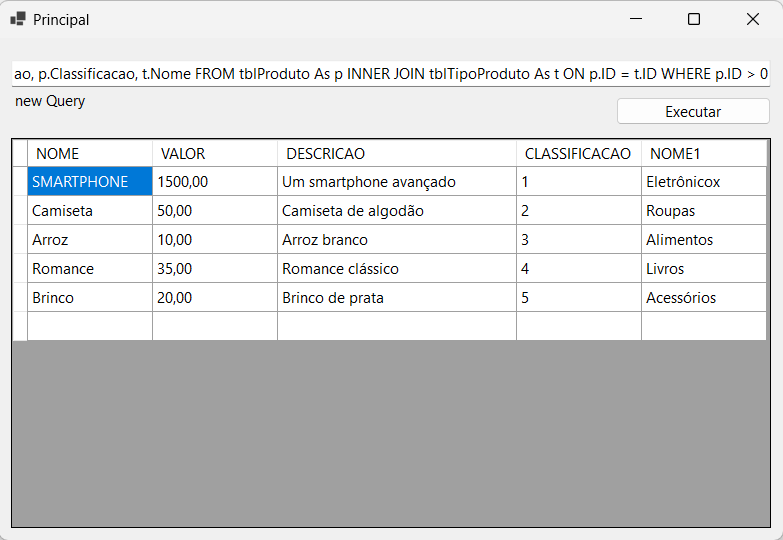

## Simple Injector Basic - sql server

---

### Resumo:

Modelo simples de utilização do simple injector com uma aplicação do Windows Forms e SQL Server 
Objetivo é ter um exemplo pratico de uso.

---

